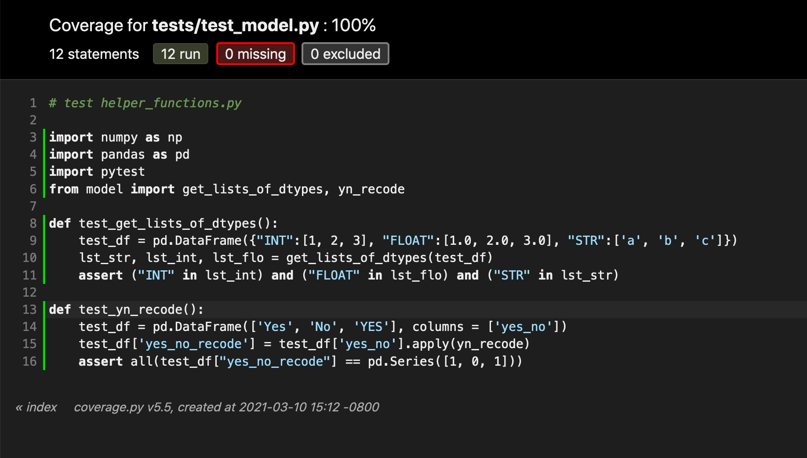
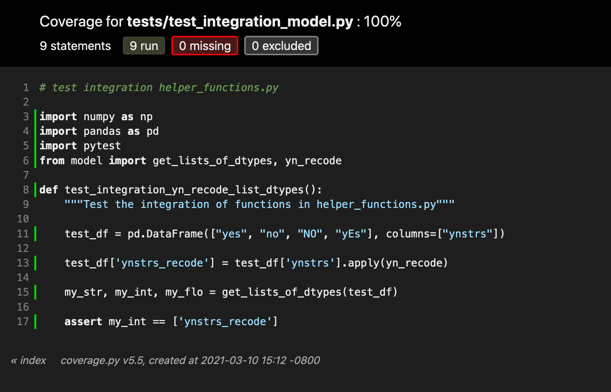

Predicting Customer Churn

Statement of Problem:
The business problem to be analyzed is the customer churn of a telecom company. The "churn" of customers is the
number or percentage of customers that cease using the service in a given time frame.

Client:
The telecommunications company Cell2Cell

Key Business Question:
The key question we would like to answer is if we can foresee and potentially prevent a customer from cancelling 
their cell phone service. We would attempt to ascertain the propensity of a customer cancelling based on details 
collected by the company.

Data Sources:
https://www.kaggle.com/jpacse/datasets-for-churn-telecom

Business Impact of Work:
We want to minimize the churn rate since this has a large impact on revenue. According to the dataset, 
14,711 customers churned over the month the data covers, costing the company about $849,10.00 in monthly revenue. 
Even if a small percentage (say 20%) of this is prevented, it is still a sizable increase in monthly revenue.

How business will use model:
The model will be used by the company to predict what customers have a high probability of churning. Then it will 
implement strategies to keep them from cancelling their service. These can include offers of special 
promotions or increased marketing.

Metric:
F-score will be used to ascertain if the model is a good fit.

Architecture:
The data architecture is stream processing currently. It could also be changed to batch processing. The models both share feature engineering, since this has to be done on both the training data and the data to be scored.

Input/Output Spec:

-Input
{'CustomerID': 3000030, 'MonthlyRevenue': 38.05, 'MonthlyMinutes': 682.0, 'TotalRecurringCharge': 52.0,
 'DirectorAssistedCalls': 0.25, 'OverageMinutes': 0.0, 'RoamingCalls': 0.0, 'PercChangeMinutes': 148.0, 
 'PercChangeRevenues': -3.1, 'DroppedCalls': 9.0, 'BlockedCalls': 1.7,'UnansweredCalls': 13.0,
 'CustomerCareCalls': 0.7, 'ThreewayCalls': 0.0, 'ReceivedCalls': 42.2, 'OutboundCalls': 6.7,
 'InboundCalls': 0.0, 'PeakCallsInOut': 33.3, 'OffPeakCallsInOut': 53.0, 'DroppedBlockedCalls': 10.7,
 'CallForwardingCalls': 0.0, 'CallWaitingCalls': 0.7, 'MonthsInService': 53, 'UniqueSubs': 1,  'ActiveSubs': 1,
 'ServiceArea': 'OKCTUL918', 'Handsets': 3.0, 'HandsetModels': 2.0, 'CurrentEquipmentDays': 231.0,
 'AgeHH1': 28.0, 'AgeHH2': 0.0, 'ChildrenInHH': 'No', 'HandsetRefurbished': 'No', 'HandsetWebCapable': 'Yes',
 'TruckOwner': 'No', 'RVOwner': 'No', 'Homeownership': 'Known', 'BuysViaMailOrder': 'No', 
 'RespondsToMailOffers': 'No', 'OptOutMailings': 'No', 'NonUSTravel': 'Yes', 'OwnsComputer': 'No', 
 'HasCreditCard': 'Yes', 'RetentionCalls': 0, 'RetentionOffersAccepted': 0, 'NewCellphoneUser': 'Yes', 
 'NotNewCellphoneUser': 'No', 'ReferralsMadeBySubscriber': 0, 'IncomeGroup': 1, 'OwnsMotorcycle': 'No',
 'AdjustmentsToCreditRating': 1, 'HandsetPrice': '30', 'MadeCallToRetentionTeam': 'No', 
 'CreditRating': '3-Good', 'PrizmCode': 'Other', 'Occupation': 'Other','MaritalStatus': 'Yes'}
 
 -Output:
 {'churn_probability': [0.28650832176208496]}
 
 Tests:
 
 
 
 
 
 
