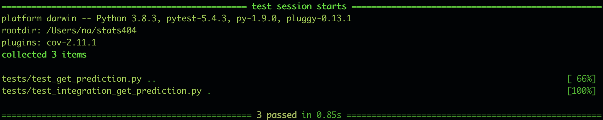

# Predicting Customer Churn #

# Statement of Problem: #
Early in the history of the cellular telecommunications industry, revenue was fueled by attracting new customers to use the service. As the industry matured, the management of the existing customer base became more important. This is in part due to the slowing growth in that sector, as well as it being less expensive to retain existing customers than attract new ones. One aspect to examine in the existing customer base is the rate at which customers abandon the service in favor of another provider, often referred to as churn. The problem we wish to solve is to minimize churn in the customer base. 

# Client: #
The client in this hypothetical example is the company Cell2Cell, which was an early entrant in in the cellular telecommunications industry. This company faced the exact scenario we examine here, and the data used was provided by this company.

# Business Impact of Work: #
According to the dataset, 14,711 customers churned during the period the data covers. This accounts for about $849,000 in monthly revenue. Even if we can prevent the loss of even a small percentage of this monthly revenue, this would make up for the initial investment of creating the model. More specific figures are given later.

# How Business Will Use Model: #
The model will output the probability of a customer churning given the inputted characteristic of that customer. The business can use these probabilities to gauge the risk of customers abandoning their service. Customers that are thought to be at a high risk of cancelling their service can be targeted with marketing strategies to increase their brand loyalty. This strategy is proactive, as opposed to the reactive strategy of dissuade customers from cancelling service once they are upset.

# Business Question: #
Can the relationship between customer characteristics and their propensity to churn be modeled, so as to create a predictive model for this behavior? 

# Data Sources: #
The source of the data is Kaggle. The data can be found at the following link: https://www.kaggle.com/jpacse/datasets-for-churn-telecom

# Methodology: #
Exploratory data analysis was performed on the churn data. A high level of missingness was not found overall, although there were some variables that had somewhat of a high missingness level. These variables were dropped. For the rest of the incomplete cases, they were either dropped, if the model required it, or were kept if the model could inherently handle missing values in an observation. The final model (xgboost) utilizes an algorithm when building its decision trees, sparsity-aware split finding, which can handle missing values rather well. The remaining variables were mostly left as they first appeared except for minor modifications. The outcome variable “Churn” was changed from the strings “Yes” and “No” to the binary values 1 and 0 respectively. The rest of the categorical variables in the dataset were one-hot encoded so the model could process them.
A series of models were implemented to model the relationship among the variables. First, a weighted logistic regression model was tried since the outcome variable is binary. The model was weighted due to the class imbalance present in the data (29% churn vs. 71% non-churn). The thinking was that this would provide a good baseline model to compare any that followed. The accuracy of the model was in the high sixties, which was not bad. After this a weighted Random Forest model was implemented. Finally, an XGBoost classifier model was fit. This had the best accuracy of all models attempted, but only somewhat better than the Random Forest model.

# Architecture: #
The data architecture is stream processing currently. It could also be changed to batch processing. The models both share feature engineering, since this has to be done on both the training data and the data to be scored.

 
 # Tests: #
 Two unit tests and one integration tests passed successfully:
 
 

 # Input/Output Spec: #
 
 The inputs for the model can be provided in json form and the output will be provided as json as well. The output will be a json object of the form {"churn_probability":[p1]} where p1 is the probability of the customer with the inputted characteristics churning.
 A sample input/output is the following:
 Input:
 {"MonthlyRevenue": 49.99, "MonthlyMinutes": 650.0, "TotalRecurringCharge": 50.0, "MonthsInService": 53}
 Output:
 {"churn_probability": [0.34538811445236206]}
 
 The previous input only includes a small subset of the features the model was trained on. A more detailed input is as follows, which includes all of the models features:
 
 {'CustomerID': 3000030, 'MonthlyRevenue': 38.05, 'MonthlyMinutes': 682.0, 'TotalRecurringCharge': 52.0,
 'DirectorAssistedCalls': 0.25, 'OverageMinutes': 0.0, 'RoamingCalls': 0.0, 'PercChangeMinutes': 148.0, 
 'PercChangeRevenues': -3.1, 'DroppedCalls': 9.0, 'BlockedCalls': 1.7,'UnansweredCalls': 13.0,
 'CustomerCareCalls': 0.7, 'ThreewayCalls': 0.0, 'ReceivedCalls': 42.2, 'OutboundCalls': 6.7,
 'InboundCalls': 0.0, 'PeakCallsInOut': 33.3, 'OffPeakCallsInOut': 53.0, 'DroppedBlockedCalls': 10.7,
 'CallForwardingCalls': 0.0, 'CallWaitingCalls': 0.7, 'MonthsInService': 53, 'UniqueSubs': 1,  'ActiveSubs': 1,
 'ServiceArea': 'OKCTUL918', 'Handsets': 3.0, 'HandsetModels': 2.0, 'CurrentEquipmentDays': 231.0,
 'AgeHH1': 28.0, 'AgeHH2': 0.0, 'ChildrenInHH': 'No', 'HandsetRefurbished': 'No', 'HandsetWebCapable': 'Yes',
 'TruckOwner': 'No', 'RVOwner': 'No', 'Homeownership': 'Known', 'BuysViaMailOrder': 'No', 
 'RespondsToMailOffers': 'No', 'OptOutMailings': 'No', 'NonUSTravel': 'Yes', 'OwnsComputer': 'No', 
 'HasCreditCard': 'Yes', 'RetentionCalls': 0, 'RetentionOffersAccepted': 0, 'NewCellphoneUser': 'Yes', 
 'NotNewCellphoneUser': 'No', 'ReferralsMadeBySubscriber': 0, 'IncomeGroup': 1, 'OwnsMotorcycle': 'No',
 'AdjustmentsToCreditRating': 1, 'HandsetPrice': '30', 'MadeCallToRetentionTeam': 'No', 
 'CreditRating': '3-Good', 'PrizmCode': 'Other', 'Occupation': 'Other','MaritalStatus': 'Yes'}
 
 # Instructions for Use: #
 
 The program was developed and run using Python 3.8.3 and Anaconda 4.9.2. There are currently two methods to use the model.
 
 ## Docker/Flask: ##
 To use the Docker version, there is a container provided called "xgb". One would have to cd to this directory and execute the following series of commands:
 
 docker build -t xgb .
 docker run -d -p 5000:5000 xgb
 curl --location --request POST 'http://localhost:5000/predict' --header 'Content-Type: application/json' --data-raw \
'{"MonthlyRevenue": 49.99, "MonthlyMinutes": 650.0, "TotalRecurringCharge": 50.0, "MonthsInService": 53}'

 This would recreate the output specified in the input/output spec. Note that the --data-raw argument can be modified to include any of the subset of features the model was trained on, which are denoted in the second sample input in the spec.
 Also note that the curl command is split over two rows due to length (not necessary).
 
 ## Running Python Script: ##
 In the directory, there is a python script called "get_prediction.py". One can simply enter the following command:
 
 python3 get_prediciton.py
 
 This will print the output to the console. Currently, the script is configured with the same input as is being passed to the data_raw argument of curl above. This can be changed by going into the script. The "requirements.txt" file has all the packages needed to execute the script.
 
 
 
 